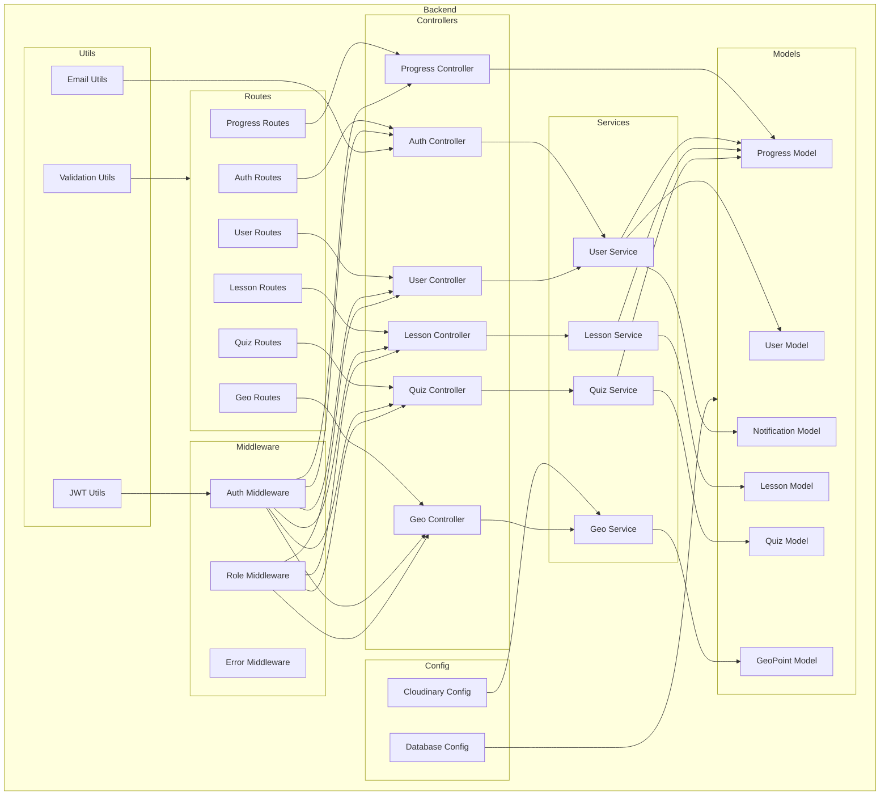

    

    <b>Automatic Architecture Diagrams from Code</b> 
    <a href="https://github.com/swark-io/swark">GitHub</a> • <a href="https://swark.io">Website</a> • <a href="mailto:contact@swark.io">Contact Us</a>

## Usage Instructions

1. **Render the Diagram**: Use the links below to open it in Mermaid Live Editor, or install the [Mermaid Support](https://marketplace.visualstudio.com/items?itemName=bierner.markdown-mermaid) extension.
2. **Recommended Model**: If available for you, use `claude-3.5-sonnet` [language model](vscode://settings/swark.languageModel). It can process more files and generates better diagrams.
3. **Iterate for Best Results**: Language models are non-deterministic. Generate the diagram multiple times and choose the best result.

## Generated Content
**Model**: GPT-4o - [Change Model](vscode://settings/swark.languageModel)  
**Mermaid Live Editor**: [View](https://mermaid.live/view#pako:eNp9lstuGyEUhl_FYp28gBeVmjiqVDVRru3CkwXxYBsVDxEDqdIo717gwHA7dFZw-Lj8P3CYD7KTIyNrMkwHRV-Pq8fNMK3sN5sXCFzQ3W82jRAtWq5tTzGnBvc9zUz5-NaVAHkukR9snuUEEJRR7M7wvwC5Eop8Y_JW8kkDFmsoeqvkQdnJAI01FL2Rmu_5jmoeV5lHmi7eG8SdB6be-I4h_oQWcChUUI8iGFzCUedOBL1TOGbdiZQtIlBPx6WctJJCMFVJ-Wr0MTVuXTWDn1vdGeyld2HQm-HBgG4HpzvDvQ1d2MrPWGdGF43nJOOXo4N26pl4L41miH8QB--gjPgWIO8ZCoE9AQteoaAzJmDeIxSyjgTGeYMi0YTALZ40cM-PJ83rzPH916OPbm0B2qtJf1LBR38HgUt1FL86US6A9MUG6q3tmo-jYH-oYu1-pTbYs1SvZr-XgmWwq_bhK6Wkymhfx_H_3NI9P5TDbi4gut1QTV_ozAJVzX4ppBn5RNV7wFOg7bC8BNlC4jyr8_MvxaNQj-yBlIhi_3QRPFDmFUDSNfBImU0AyS-Bh-osAli6Ah4qMwcgywWI662B8vh7qs0UuboUXZa_eNBmR5yp5WQaC65UtIgsmEJTsyt45itk-l2OCrOlLksPANZcjYEhzRMcpyr0Zg5kY7UIuujMk8WjbJS6GR0jmRY9TL8j-fanm9w94AiGHXIEw485AmJHHcGQ845Q_fNeZr6uEgTDlSAgpgTBKiXAxWdm2Yk63VfPjOfy5zu9K-hmkjNyYsoyo_2p_hiIPrITG8h6NZCR7akReiCfFjKvdhK24dTm7xNZa2XYGaFGy4f3aRfrSprDkaz3VMzs8x-o7MyJ) | [Edit](https://mermaid.live/edit#pako:eNp9lstuGyEUhl_FYp28gBeVmjiqVDVRru3CkwXxYBsVDxEDqdIo717gwHA7dFZw-Lj8P3CYD7KTIyNrMkwHRV-Pq8fNMK3sN5sXCFzQ3W82jRAtWq5tTzGnBvc9zUz5-NaVAHkukR9snuUEEJRR7M7wvwC5Eop8Y_JW8kkDFmsoeqvkQdnJAI01FL2Rmu_5jmoeV5lHmi7eG8SdB6be-I4h_oQWcChUUI8iGFzCUedOBL1TOGbdiZQtIlBPx6WctJJCMFVJ-Wr0MTVuXTWDn1vdGeyld2HQm-HBgG4HpzvDvQ1d2MrPWGdGF43nJOOXo4N26pl4L41miH8QB--gjPgWIO8ZCoE9AQteoaAzJmDeIxSyjgTGeYMi0YTALZ40cM-PJ83rzPH916OPbm0B2qtJf1LBR38HgUt1FL86US6A9MUG6q3tmo-jYH-oYu1-pTbYs1SvZr-XgmWwq_bhK6Wkymhfx_H_3NI9P5TDbi4gut1QTV_ozAJVzX4ppBn5RNV7wFOg7bC8BNlC4jyr8_MvxaNQj-yBlIhi_3QRPFDmFUDSNfBImU0AyS-Bh-osAli6Ah4qMwcgywWI662B8vh7qs0UuboUXZa_eNBmR5yp5WQaC65UtIgsmEJTsyt45itk-l2OCrOlLksPANZcjYEhzRMcpyr0Zg5kY7UIuujMk8WjbJS6GR0jmRY9TL8j-fanm9w94AiGHXIEw485AmJHHcGQ845Q_fNeZr6uEgTDlSAgpgTBKiXAxWdm2Yk63VfPjOfy5zu9K-hmkjNyYsoyo_2p_hiIPrITG8h6NZCR7akReiCfFjKvdhK24dTm7xNZa2XYGaFGy4f3aRfrSprDkaz3VMzs8x-o7MyJ)

